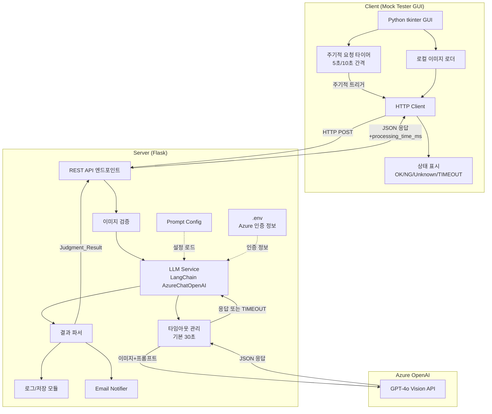

# 기술 설계 문서: AI Alarm System (POC)

## 개요

AI Alarm System POC는 Client-Server 구조로, Client가 로컬 이미지를 Server에 전송하면 Server가 Azure OpenAI의 Vision API를 활용하여 화면 상태를 분석하고 판단 결과(OK/NG/Unknown)를 반환하는 시스템이다.

POC 범위에서는 다음에 집중한다:
- Client: Python GUI(Mock Tester) — 로컬 이미지를 선택하여 단건 분석 요청, 주기적 자동 요청 지원
- Server: Flask 기반 REST API — 이미지 수신, LLM 분석, 결과 반환, LLM 호출 타임아웃 관리
- LLM: Azure OpenAI GPT-4o Vision API (사용자가 Azure 코드 제공 예정)

### POC 우선순위

| 우선순위 | 기능 | 설명 |
|---------|------|------|
| P0 | Server API + LLM 분석 | 핵심 분석 파이프라인 (단건 분석) |
| P0 | Client GUI (Mock Tester) | 이미지 업로드, 주기적 요청, 결과 확인 |
| P0 | LLM 호출 타임아웃 | Server 응답 지연 방지 |
| P1 | 판단 결과 저장/로그 | JSON 파일 기반 저장 |
| P1 | 프롬프트 설정 관리 | YAML 설정 파일 |
| P2 | 이메일 알림 | Unknown 상황 알림 |
| P2 | 재시도 로직 | 전송/이메일 재시도 |

### 단건 분석 + 주기적 요청 방식

Client는 이미지를 한 번에 하나씩 Server에 전송하여 분석을 요청한다. 주기적 모니터링이 필요한 경우, Client GUI에서 설정한 간격(5초 또는 10초)으로 자동 반복 요청을 수행한다.

1. Client GUI에서 이미지 파일을 선택하거나 캡처
2. **단건 API** (`POST /api/v1/analyze`)로 이미지 분석 요청
3. Server가 LLM을 호출하여 분석 후 결과 반환 (타임아웃 내)
4. Client GUI에서 결과를 표시 (OK/NG/Unknown/TIMEOUT 색상 구분)
5. 주기적 모드 활성화 시, 설정된 간격으로 자동 반복 요청

응답 지연 방지:
- Server는 LLM 호출에 타임아웃을 설정 (기본 30초)
- 타임아웃 초과 시 Client에 TIMEOUT 상태를 반환
- Client GUI에서 TIMEOUT/지연 상태를 시각적으로 표시
- 응답에 `processing_time_ms` 필드를 포함하여 처리 시간 추적

## 아키텍처

### 시스템 구성도



### 기술 스택

| 구성요소 | 기술 |
|---------|------|
| Client GUI | Python 3.12.9, tkinter |
| Server | Python 3.12.9, Flask, waitress (Windows 호환 WSGI 서버) |
| LLM | Azure OpenAI GPT-4o (Vision) via `langchain-openai` (`AzureChatOpenAI`) |
| HTTP 통신 | requests (Client→Server 동기 통신) |
| LLM 호출 | langchain-openai (AzureChatOpenAI, predict_messages) |
| 설정 관리 | PyYAML (프롬프트 설정), python-dotenv (Azure 인증 정보) |
| 이메일 | smtplib (표준 라이브러리) |
| 데이터 저장 | JSON 파일 (POC) |

### 주요 의존성

```
flask
waitress
requests
langchain-openai
python-dotenv
PyYAML
```


## 컴포넌트 및 인터페이스

### 1. Client (Mock Tester GUI)

#### 모듈 구조

```
client/
├── main.py              # GUI 진입점
├── gui.py               # tkinter GUI 컴포넌트
├── api_client.py        # Server HTTP 통신
├── periodic_runner.py   # 주기적 요청 관리
└── models.py            # 데이터 모델 (공유)
```

#### 테스트 이미지 폴더 구조

테스트 이미지는 기대 결과(expected result) 기준으로 폴더를 구분한다. 폴더명이 곧 기대값이 되어, LLM 판단 결과(actual)와 비교하여 정확도를 검증할 수 있다.

```
test_images/
├── ok/                    # OK로 판단되어야 하는 이미지들
│   ├── normal_screen_01.png
│   └── normal_screen_02.png
├── ng/                    # NG로 판단되어야 하는 이미지들
│   ├── error_popup_01.png
│   └── broken_layout_01.png
└── unknown/               # 예상하지 못한 상황 이미지들
    └── unexpected_01.png
```

- 사용자가 각 폴더에 테스트용 이미지를 직접 넣는다
- Client GUI에서 폴더를 선택하면 하위 이미지를 자동 탐색
- 폴더명(`ok`/`ng`/`unknown`)을 기대값(expected)으로 사용
- 결과 테이블에서 기대값 vs LLM 판단값(actual) 비교 표시 (일치=✓, 불일치=✗)

#### GUI 기능
- 테스트 이미지 폴더 선택 (폴더 브라우저) — `test_images/` 하위 폴더 자동 탐색
- 이미지 목록 표시 (폴더명 = 기대 결과)
- 단건 분석 요청 버튼
- 주기적 요청 모드: 시작/중지 버튼, 간격 설정 (5초/10초 드롭다운)
- 결과 테이블: 이미지명, 기대값(expected), 판단값(actual), 일치여부, 판단이유, 처리시간
- 상태별 색상 구분 (OK=초록, NG=빨강, Unknown=노랑, TIMEOUT=회색)
- 기대값 불일치 시 행 배경색 강조 (빨간 테두리 등)
- 응답 지연/타임아웃 상태 표시
- 최근 요청 이력 테이블

#### API Client 인터페이스

```python
class AlarmApiClient:
    def __init__(self, base_url: str, request_timeout: float = 35.0):
        """Server 기본 URL 및 요청 타임아웃 설정"""

    def analyze_single(self, image_path: Path) -> JudgmentResult:
        """단건 이미지 분석 요청 (동기)"""

    def health_check(self) -> bool:
        """Server 상태 확인 (동기)"""
```

> **참고**: `image_path`는 `pathlib.Path`를 사용하여 Windows/Linux 경로 호환성을 보장한다.
> **참고**: `request_timeout`은 Server의 LLM 타임아웃(30초)보다 약간 크게 설정하여, Server가 TIMEOUT 응답을 반환할 시간을 확보한다.

#### 주기적 요청 관리

```python
class PeriodicRunner:
    def __init__(self, api_client: AlarmApiClient, interval_seconds: int = 5):
        """주기적 요청 실행기 초기화"""

    def start(self, image_path: Path, callback: Callable[[JudgmentResult], None]):
        """주기적 분석 요청 시작 (별도 스레드)"""

    def stop(self):
        """주기적 요청 중지"""

    def set_interval(self, seconds: int):
        """요청 간격 변경 (5 또는 10초)"""

    @property
    def is_running(self) -> bool:
        """현재 실행 중 여부"""
```

### 2. Server (Flask)

#### 모듈 구조

```
server/
├── main.py              # Flask 앱 진입점
├── .env                 # Azure OpenAI 인증 정보 (gitignore 대상)
├── api/
│   └── routes.py        # API 라우트 정의
├── services/
│   ├── llm_service.py   # Azure OpenAI 호출 (LangChain AzureChatOpenAI)
│   ├── image_validator.py  # 이미지 검증
│   └── email_notifier.py   # 이메일 알림
├── models.py            # 데이터 모델
├── config.py            # 설정 로드
├── logger.py            # 로그/저장 관리
└── prompt_config.yaml   # 프롬프트 설정 파일
```

#### API 엔드포인트

| 메서드 | 경로 | 설명 |
|--------|------|------|
| POST | `/api/v1/analyze` | 단건 이미지 분석 |
| GET | `/api/v1/health` | 서버 상태 확인 |

#### 단건 분석 API

```
POST /api/v1/analyze
Content-Type: multipart/form-data

Parameters:
  - image: UploadFile (PNG/JPEG)
  - request_id: str (optional, 자동 생성)

Response (200):
{
  "request_id": "req_20240101_001",
  "status": "OK" | "NG" | "UNKNOWN",
  "reason": "모든 장비 정상. S520 Curing Oven 최대값 3017 (14#), Preheating Oven 최대값 1439 (14#)",
  "timestamp": "2024-01-01T12:00:00Z",
  "processing_time_ms": 1523,
  "equipment_data": {
    "S520": {
      "identified": true,
      "curing_oven": {"1": 3017, "2": 2938, ...},
      "preheating_oven": {"14": 1439, "15": 1335, ...},
      "ng_items": ["1#: 3017 (3000 이상)"]
    },
    "S530": { "identified": true, ... },
    "S540": { "identified": true, "stations": {"1-1": {"count": 168, "color": "green"}, ...} },
    "S810": { "identified": true, ... }
  }
}

Response (200, 타임아웃 시):
{
  "request_id": "req_20240101_002",
  "status": "TIMEOUT",
  "reason": "LLM 응답 타임아웃 (30초 초과)",
  "timestamp": "2024-01-01T12:00:30Z",
  "processing_time_ms": 30000
}
```

### 3. LLM Service

```python
import base64
import time
from concurrent.futures import ThreadPoolExecutor, TimeoutError as FuturesTimeoutError
from dotenv import load_dotenv
from langchain_openai import AzureChatOpenAI
from langchain.schema import HumanMessage

load_dotenv()

def get_azure_vision_llm() -> AzureChatOpenAI:
    """Azure OpenAI Vision LLM 클라이언트 팩토리 함수"""
    return AzureChatOpenAI(
        azure_endpoint=os.getenv("AZURE_OPENAI_ENDPOINT"),
        api_key=os.getenv("AZURE_OPENAI_API_KEY"),
        api_version=os.getenv("API_VERSION", "2024-12-01-preview"),
        azure_deployment=os.getenv("VISION_MODEL", os.getenv("CHAT_MODEL", "gpt-4o-korea-rag")),
        timeout=30,  # LLM 호출 타임아웃 (초)
    )

class LLMService:
    def __init__(self, config: PromptConfig, timeout_seconds: int = 30):
        """AzureChatOpenAI 클라이언트 초기화 (LangChain 사용)"""
        self.config = config
        self.timeout_seconds = timeout_seconds
        self.llm = get_azure_vision_llm()

    def analyze_image(self, image_bytes: bytes, image_format: str) -> tuple[LLMResponse, int]:
        """
        이미지를 Azure OpenAI Vision API로 분석 (LangChain predict_messages 사용)
        
        Returns:
            tuple[LLMResponse, int]: (분석 결과, 처리 시간 ms)
            타임아웃 시 LLMResponse.status = TIMEOUT
        """
        start_time = time.monotonic()

        # 1. 이미지를 base64 인코딩
        b64_image = base64.b64encode(image_bytes).decode("utf-8")
        mime_type = f"image/{image_format}"

        # 2. LangChain HumanMessage 구성 (이미지 + 프롬프트)
        prompt_text = self._build_prompt()
        langchain_messages = [
            HumanMessage(content=[
                {"type": "text", "text": prompt_text},
                {"type": "image_url", "image_url": {"url": f"data:{mime_type};base64,{b64_image}"}},
            ])
        ]

        try:
            # 3. LLM 호출 (타임아웃 적용)
            response = self.llm.predict_messages(langchain_messages)
            answer = response.content

            elapsed_ms = int((time.monotonic() - start_time) * 1000)

            # 4. JSON 파싱하여 LLMResponse 반환
            return self._parse_response(answer), elapsed_ms

        except (FuturesTimeoutError, TimeoutError, Exception) as e:
            elapsed_ms = int((time.monotonic() - start_time) * 1000)
            if elapsed_ms >= self.timeout_seconds * 1000 or isinstance(e, (FuturesTimeoutError, TimeoutError)):
                return LLMResponse(
                    status=JudgmentStatus.TIMEOUT,
                    reason=f"LLM 응답 타임아웃 ({self.timeout_seconds}초 초과)",
                    raw_response="",
                ), elapsed_ms
            raise

    def _build_prompt(self) -> str:
        """Prompt_Config 기반 프롬프트 생성"""

    def _parse_response(self, raw_response: str) -> LLMResponse:
        """LLM 응답 문자열을 LLMResponse 객체로 파싱"""
```

### 4. Image Validator

```python
class ImageValidator:
    ALLOWED_FORMATS = {"png", "jpeg", "jpg"}
    MAX_SIZE_MB = 20

    @staticmethod
    def validate(image_bytes: bytes, filename: str) -> ValidationResult:
        """이미지 형식 및 크기 검증"""
```

### 5. Email Notifier

```python
class EmailNotifier:
    def __init__(self, config: EmailConfig):
        """SMTP 설정 초기화"""

    def send_alert(self, judgment: JudgmentResult) -> bool:
        """Unknown 상태 알림 이메일 전송 (동기, 최대 3회 재시도)"""
```


## 데이터 모델

### 핵심 데이터 모델

```python
from dataclasses import dataclass, field
from enum import Enum
from datetime import datetime
from pathlib import Path
import uuid


class JudgmentStatus(str, Enum):
    OK = "OK"
    NG = "NG"
    UNKNOWN = "UNKNOWN"
    TIMEOUT = "TIMEOUT"


@dataclass
class JudgmentResult:
    request_id: str
    status: JudgmentStatus
    reason: str
    timestamp: str  # ISO 8601 형식
    processing_time_ms: int = 0  # 처리 시간 (밀리초)
    image_name: str = ""

    def to_dict(self) -> dict:
        return {
            "request_id": self.request_id,
            "status": self.status.value,
            "reason": self.reason,
            "timestamp": self.timestamp,
            "processing_time_ms": self.processing_time_ms,
            "image_name": self.image_name,
        }

    @classmethod
    def from_dict(cls, data: dict) -> "JudgmentResult":
        return cls(
            request_id=data["request_id"],
            status=JudgmentStatus(data["status"]),
            reason=data["reason"],
            timestamp=data["timestamp"],
            processing_time_ms=data.get("processing_time_ms", 0),
            image_name=data.get("image_name", ""),
        )


@dataclass
class ValidationResult:
    is_valid: bool
    error_message: str = ""


@dataclass
class LLMResponse:
    status: JudgmentStatus
    reason: str
    raw_response: str = ""
```

### 설정 파일 구조

#### prompt_config.yaml

```yaml
system_prompt: |
  당신은 제조 장비 HMI 패널 이미지를 분석하는 AI 전문가입니다.
  주어진 이미지에는 4개의 원격 연결 패널이 포함되어 있으며, 각 패널은 S520, S530, S540, S810 장비 중 하나입니다.
  패널의 위치는 변경될 수 있으므로, 반드시 패널 상단의 장비 번호(S520, S530, S540, S810)를 먼저 식별하세요.

equipment_definitions:
  S520:
    name: "S520 - Preheating & Curing"
    description: "Curing Oven(1#~14#)과 Preheating Oven(14#~27#) 두 테이블이 있음"
    data_extraction:
      - table: "Curing Oven"
        columns: "1# ~ 14#"
        target_row: "흰색 배경 행 (누적 수량)"
      - table: "Preheating Oven"
        columns: "14# ~ 27#"
        target_row: "흰색 배경 행 (누적 수량)"
    total_values: 28
    ng_condition: "어떤 수량이든 3000 이상이면 NG"

  S530:
    name: "S530 - Cooling"
    description: "Cooling 1 Line(IN)과 Cooling 2 Line(Out) 두 테이블이 있음"
    data_extraction:
      - table: "Cooling 1 Line(IN)"
        columns: "1# ~ 14#"
        target_row: "흰색 배경 행 (누적 수량)"
      - table: "Cooling 2 Line(Out)"
        columns: "14# ~ 27#"
        target_row: "흰색 배경 행 (누적 수량)"
    total_values: 28
    ng_condition: "어떤 수량이든 3000 이상이면 NG"

  S540:
    name: "S540 - Robot"
    description: "3D 레이아웃 뷰에 1번~6번 스테이션이 있고, 각 스테이션에 2개씩(X-1, X-2) 수량 표시"
    data_extraction:
      - stations: "1-1, 1-2, 2-1, 2-2, 3-1, 3-2, 4-1, 4-2, 5-1, 5-2, 6-1, 6-2"
        target: "각 스테이션 옆의 수량 값과 배경색"
    total_values: 12
    ng_condition: "스테이션 번호 배경색이 빨간색 또는 검은색이면 NG"

  S810:
    name: "S810 - Housing Cooling"
    description: "Cooling 1 line과 Cooling 2 line 두 테이블이 있음"
    data_extraction:
      - table: "Cooling 1 line"
        columns: "1# ~ 15#"
        target_row: "흰색 배경 행 (누적 수량)"
      - table: "Cooling 2 line"
        columns: "1# ~ 15#"
        target_row: "흰색 배경 행 (누적 수량)"
    total_values: 30
    ng_condition: "어떤 수량이든 3000 이상이면 NG"

judgment_criteria:
  step1_identification: |
    이미지에서 4개의 패널을 식별하고, 각 패널 상단의 장비 번호(S520, S530, S540, S810)를 확인하세요.
    4개 장비가 모두 식별되지 않으면 UNKNOWN으로 판단하세요.

  step2_data_extraction: |
    각 장비별로 지정된 데이터를 추출하세요:
    - S520: Curing Oven(1#~14#) + Preheating Oven(14#~27#) 흰색 행 수량 28개
    - S530: Cooling 1 Line(1#~14#) + Cooling 2 Line(14#~27#) 흰색 행 수량 28개
    - S810: Cooling 1 line(1#~15#) + Cooling 2 line(1#~15#) 흰색 행 수량 30개
    - S540: 1-1, 1-2 ~ 6-1, 6-2 스테이션별 수량 12개 + 각 스테이션 배경색
    필요한 수량을 모두 추출하지 못하면 UNKNOWN으로 판단하세요.

  step3_judgment: |
    추출된 데이터를 기반으로 판단하세요:
    [NG 조건]
    - S520, S530, S810: 어떤 수량이든 3000 이상이면 NG (해당 장비와 번호 명시)
    - S540: 스테이션 번호(1-1~6-2)의 배경색이 빨간색 또는 검은색이면 NG (해당 스테이션 명시)
    [OK 조건]
    - 위 NG 조건에 해당하지 않고, 모든 데이터가 정상 추출된 경우
    [UNKNOWN 조건]
    - 4개 장비 중 하나라도 식별 불가
    - 필요한 수량 데이터를 모두 추출하지 못한 경우

response_format:
  type: "json"
  schema: |
    {
      "status": "OK | NG | UNKNOWN",
      "reason": "판단 이유를 한국어로 설명",
      "equipment_data": {
        "S520": {
          "identified": true/false,
          "curing_oven": {"1": 수량, "2": 수량, ..., "14": 수량},
          "preheating_oven": {"14": 수량, "15": 수량, ..., "27": 수량},
          "ng_items": ["항목번호: 수량 (3000 이상)"]
        },
        "S530": {
          "identified": true/false,
          "cooling_1_line": {"1": 수량, ..., "14": 수량},
          "cooling_2_line": {"14": 수량, ..., "27": 수량},
          "ng_items": []
        },
        "S540": {
          "identified": true/false,
          "stations": {
            "1-1": {"count": 수량, "color": "green|red|black|white"},
            "1-2": {"count": 수량, "color": "green|red|black|white"},
            ...
            "6-1": {"count": 수량, "color": "green|red|black|white"},
            "6-2": {"count": 수량, "color": "green|red|black|white"}
          },
          "ng_items": ["스테이션번호: 색상 (빨간색/검은색)"]
        },
        "S810": {
          "identified": true/false,
          "cooling_1_line": {"1": 수량, ..., "15": 수량},
          "cooling_2_line": {"1": 수량, ..., "15": 수량},
          "ng_items": []
        }
      }
    }
```

#### server_config.yaml

```yaml
server:
  host: "0.0.0.0"
  port: 8000
  llm_timeout_seconds: 30  # LLM 호출 타임아웃 (초)

client:
  periodic_interval_seconds: 5  # 주기적 요청 간격 (초), 5 또는 10

email:
  smtp_host: ""
  smtp_port: 587
  sender: ""
  password: ""
  recipients: []

storage:
  results_dir: "data/results"
  logs_dir: "data/logs"
  unknown_images_dir: "data/unknown_images"
```

#### .env (Azure OpenAI 인증 정보)

```env
# Azure OpenAI 설정
AZURE_OPENAI_ENDPOINT=https://your-resource.openai.azure.com/
AZURE_OPENAI_API_KEY=your-api-key-here
API_VERSION=2024-12-01-preview
CHAT_MODEL=gpt-4o-korea-rag
VISION_MODEL=gpt-4o-korea-rag
```

> **보안 참고**: `.env` 파일은 `.gitignore`에 반드시 추가하여 버전 관리에서 제외한다. `python-dotenv`의 `load_dotenv()`를 사용하여 환경변수를 로드한다.

> **Windows 호환성 참고**: 모든 파일 경로는 `pathlib.Path`를 사용하여 OS 독립적으로 처리한다. 하드코딩된 `/` 또는 `\\` 경로 구분자를 사용하지 않는다.

### 디렉토리 구조 (저장)

> 모든 경로는 `pathlib.Path`로 구성하여 Windows/Linux 모두 호환된다.

```
data/
├── results/
│   └── req_20240101_001.json    # 판단 결과 JSON
├── logs/
│   └── 2024-01-01.log           # 일별 로그 파일
└── unknown_images/
    └── req_20240101_003.png     # Unknown 판단 이미지 복사본
```


## 정확성 속성 (Correctness Properties)

*속성(Property)은 시스템의 모든 유효한 실행에서 참이어야 하는 특성 또는 동작이다. 속성은 사람이 읽을 수 있는 명세와 기계가 검증할 수 있는 정확성 보장 사이의 다리 역할을 한다.*

### Property 1: 이미지 형식 검증

*For any* 파일 바이트와 파일명에 대해, ImageValidator는 PNG 또는 JPEG 형식인 경우에만 유효(is_valid=True)를 반환하고, 그 외 형식은 항상 무효(is_valid=False)와 오류 메시지를 반환해야 한다.

**Validates: Requirements 3.2, 3.3**

### Property 2: JudgmentResult 직렬화 라운드트립

*For any* 유효한 JudgmentResult 객체에 대해, `to_dict()`로 직렬화한 후 `from_dict()`로 역직렬화하면 원본과 동일한 객체가 생성되어야 한다. 이는 `processing_time_ms` 필드를 포함한 모든 필드에 적용된다.

**Validates: Requirements 6.4, 6.5**

### Property 3: LLM 응답 파싱 시 필수 필드 포함

*For any* 유효한 LLM JSON 응답을 파싱하여 생성된 JudgmentResult는 반드시 판단 상태(OK/NG/UNKNOWN), 판단 이유(비어있지 않은 문자열), 타임스탬프를 포함해야 한다.

**Validates: Requirements 6.1, 6.2, 9.2**

### Property 4: 잘못된 JSON 응답은 Unknown 처리

*For any* 유효한 JSON 형식이 아닌 문자열이 LLM 응답으로 수신되면, 파서는 해당 요청을 UNKNOWN 상태로 처리하고 오류 정보를 포함한 JudgmentResult를 반환해야 한다.

**Validates: Requirements 6.3**

### Property 5: 프롬프트에 판단 조건 포함

*For any* PromptConfig에 정의된 OK/NG/Unknown 판단 조건에 대해, 빌드된 프롬프트 문자열은 해당 조건 텍스트를 모두 포함해야 한다.

**Validates: Requirements 4.2**

### Property 6: 요청 메타데이터 포함

*For any* Client에서 생성된 분석 요청에 대해, 요청에는 반드시 타임스탬프와 고유한 요청 식별자(request_id)가 포함되어야 한다.

**Validates: Requirements 2.2**

### Property 7: 로그에 필수 정보 포함

*For any* JudgmentResult에 대해 생성된 로그 항목은 반드시 판단 이유, 타임스탬프, 요청 식별자를 포함해야 한다.

**Validates: Requirements 7.2**

### Property 8: 이메일 본문에 필수 정보 포함

*For any* Unknown 상태의 JudgmentResult로 생성된 알림 이메일 본문은 반드시 판단 이유, 타임스탬프, 요청 식별자를 포함해야 한다.

**Validates: Requirements 8.2**

### Property 9: request_id 기반 결과 조회

*For any* 저장된 JudgmentResult에 대해, 해당 request_id로 조회하면 저장된 것과 동일한 결과를 반환해야 한다.

**Validates: Requirements 7.4**

### Property 10: 응답에 처리 시간 포함

*For any* Server의 분석 응답에 대해, `processing_time_ms` 필드가 반드시 포함되어야 하며 0 이상의 정수여야 한다. TIMEOUT 응답의 경우 `processing_time_ms`는 타임아웃 설정값(밀리초) 이상이어야 한다.

**Validates: Requirements 9.2 (확장)**


## 오류 처리

### 오류 처리 전략

| 오류 유형 | 처리 방식 | 관련 요구사항 |
|-----------|----------|--------------|
| 이미지 형식 오류 | 400 Bad Request + 오류 메시지 반환 | 3.3 |
| LLM API 호출 실패 | 로그 기록 + 500 Internal Server Error 반환 | 4.4 |
| LLM 응답 타임아웃 | TIMEOUT 상태 + processing_time_ms 포함하여 200 반환 | 신규 |
| LLM 응답 파싱 실패 | UNKNOWN 상태로 처리 + 로그 기록 | 6.3 |
| 설정 파일 누락/오류 | 서버 시작 중단 + 오류 로그 | 5.3 |
| 이메일 전송 실패 | 최대 3회 재시도 + 실패 로그 | 8.3 |
| Client 전송 실패 | 최대 3회 재시도 + 실패 로그 | 2.3, 2.4 |
| 파일 저장 실패 | 로그 기록 + 응답에는 영향 없음 | 7.1 |
| Client 주기적 요청 중 오류 | 오류 로그 기록 + 다음 주기에 재시도 | 신규 |

### 오류 응답 형식

```json
{
  "error": {
    "code": "INVALID_IMAGE_FORMAT",
    "message": "지원하지 않는 이미지 형식입니다. PNG 또는 JPEG만 허용됩니다.",
    "request_id": "req_20240101_001",
    "timestamp": "2024-01-01T12:00:00Z"
  }
}
```

### 타임아웃 응답 형식

타임아웃은 오류가 아닌 정상 응답(200)으로 처리한다. LLM이 시간 내에 응답하지 못한 것이지 서버 오류가 아니기 때문이다.

```json
{
  "request_id": "req_20240101_002",
  "status": "TIMEOUT",
  "reason": "LLM 응답 타임아웃 (30초 초과)",
  "timestamp": "2024-01-01T12:00:30Z",
  "processing_time_ms": 30000
}
```

### 오류 코드 정의

| 코드 | HTTP 상태 | 설명 |
|------|----------|------|
| INVALID_IMAGE_FORMAT | 400 | 지원하지 않는 이미지 형식 |
| IMAGE_TOO_LARGE | 400 | 이미지 크기 초과 |
| LLM_SERVICE_ERROR | 500 | LLM API 호출 실패 (타임아웃 외) |
| LLM_PARSE_ERROR | 500 | LLM 응답 파싱 실패 |
| CONFIG_ERROR | 500 | 설정 파일 오류 |
| STORAGE_ERROR | 500 | 파일 저장 실패 |

> **참고**: TIMEOUT은 오류 코드가 아닌 JudgmentStatus의 한 값으로 처리된다. Server가 타임아웃을 감지하고 정상 응답 형식으로 Client에 반환한다.

## 테스트 전략

### 이중 테스트 접근법

이 프로젝트는 단위 테스트와 속성 기반 테스트(Property-Based Testing)를 병행한다.

- **단위 테스트**: 특정 예제, 엣지 케이스, 오류 조건 검증
- **속성 기반 테스트**: 모든 입력에 대한 보편적 속성 검증
- 두 방식은 상호 보완적이며, 함께 사용하여 포괄적 커버리지를 달성한다

### 속성 기반 테스트 라이브러리

- **Hypothesis** (Python) — 가장 성숙한 Python PBT 라이브러리
- 각 속성 테스트는 최소 100회 반복 실행
- 각 테스트에 설계 문서의 Property 번호를 태그로 포함

태그 형식: `Feature: ai-alarm-system, Property {number}: {property_text}`

### 단위 테스트 범위

| 테스트 대상 | 테스트 내용 | 관련 요구사항 |
|------------|------------|--------------|
| 이미지 로드 실패 | 존재하지 않는 파일 로드 시 오류 처리 | 1.3 |
| HTTP 전송 | Client → Server 요청 구성 확인 | 2.1 |
| 재시도 로직 | 전송 실패 시 최대 3회 재시도 | 2.3, 2.4 |
| 서버 이미지 수신 | multipart/form-data 수신 확인 | 3.1 |
| LLM 호출 | Mock LLM(AzureChatOpenAI)으로 올바른 메시지 구성 확인 | 4.1, 4.3 |
| LLM 타임아웃 | LLM 호출 타임아웃 시 TIMEOUT 상태 반환 확인 | 신규 |
| 설정 파일 로드 | YAML 파일 로드 및 검증 | 5.1, 5.2, 5.3 |
| 결과 저장 | JSON 파일 저장 및 Unknown 이미지 저장 | 7.1, 7.3 |
| 이메일 전송 | Unknown 시 이메일 트리거 및 재시도 | 8.1, 8.3, 8.4 |
| Client 응답 수신 | JSON 응답 수신 및 파싱 | 9.1, 9.3, 9.4 |
| 주기적 요청 | PeriodicRunner 시작/중지/간격 변경 | 신규 |
| 타임아웃 GUI 표시 | TIMEOUT 상태 시 GUI 상태 표시 로직 | 신규 |

### 속성 기반 테스트 범위

| Property | 테스트 내용 | Generator |
|----------|------------|-----------|
| P1 | 이미지 형식 검증 | 임의의 바이트 + 파일 확장자 |
| P2 | JudgmentResult 라운드트립 | 임의의 JudgmentResult 객체 (TIMEOUT 포함) |
| P3 | LLM 응답 파싱 필수 필드 | 임의의 유효 JSON 응답 |
| P4 | 잘못된 JSON → Unknown | 임의의 비-JSON 문자열 |
| P5 | 프롬프트 조건 포함 | 임의의 PromptConfig |
| P6 | 요청 메타데이터 포함 | 임의의 분석 요청 |
| P7 | 로그 필수 정보 포함 | 임의의 JudgmentResult |
| P8 | 이메일 필수 정보 포함 | 임의의 Unknown JudgmentResult |
| P9 | request_id 기반 조회 | 임의의 저장된 JudgmentResult |
| P10 | 응답 처리 시간 포함 | 임의의 Server 응답 |

### 테스트 실행

```bash
# 단위 테스트
pytest tests/unit/ -v

# 속성 기반 테스트
pytest tests/property/ -v --hypothesis-seed=0

# 전체 테스트
pytest tests/ -v
```

### Windows 환경 고려사항

| 항목 | 설명 |
|------|------|
| 경로 처리 | 모든 파일/디렉토리 경로는 `pathlib.Path`를 사용하여 OS 독립적으로 처리 |
| 서버 실행 | Flask 내장 서버(개발) 또는 `waitress`(프로덕션급) 사용. `gunicorn`은 Windows 미지원 |
| 프로세스 관리 | Windows에서는 `signal.SIGTERM` 대신 `signal.SIGBREAK` 또는 `atexit` 모듈 사용 |
| 파일 잠금 | Windows 파일 잠금 특성 고려 — 로그/결과 파일 쓰기 시 `with open()` 패턴으로 즉시 핸들 해제 |
| 인코딩 | 파일 읽기/쓰기 시 `encoding='utf-8'`을 명시적으로 지정 |

#### 서버 실행 방법

```bash
# 개발 환경 (Flask 내장 서버)
python server/main.py
# → Flask 내장 서버가 http://0.0.0.0:8000 에서 실행

# 프로덕션 환경 (Windows 호환 WSGI 서버)
pip install waitress
waitress-serve --host=0.0.0.0 --port=8000 server.main:app
```


## 테스트 케이스 레퍼런스 데이터

실제 HMI 패널 이미지에서 추출한 데이터를 기반으로 한 테스트 케이스이다. LLM이 이미지를 분석한 결과가 아래 기대값과 일치하는지 검증한다.

### Case 1: OK 케이스 (정상 — 모든 수량 3000 미만, S540 스테이션 정상)

기대 판단: **OK**

#### S520 - Preheating & Curing

Curing Oven (흰색 행, 1#→14#):

| 1# | 2# | 3# | 4# | 5# | 6# | 7# | 8# | 9# | 10# | 11# | 12# | 13# | 14# |
|----|----|----|----|----|----|----|----|----|-----|-----|-----|-----|-----|
| 3017 | 2938 | 2812 | 2668 | 2590 | 2462 | 2169 | 2098 | 1984 | 1910 | 1799 | 1723 | 1647 | 1524 |

> 참고: 이 케이스에서 1#=3017은 NG 조건(≥3000)에 해당하므로, 실제로는 NG 케이스이다. OK 케이스 테스트 시에는 모든 값이 3000 미만인 이미지를 사용해야 한다.

Preheating Oven (흰색 행, 27#→14#):

| 27# | 26# | 25# | 24# | 23# | 22# | 21# | 20# | 19# | 18# | 17# | 16# | 15# | 14# |
|-----|-----|-----|-----|-----|-----|-----|-----|-----|-----|-----|-----|-----|-----|
| 0 | 25 | 129 | 248 | 352 | 456 | 636 | 740 | 844 | 956 | 1098 | 1231 | 1335 | 1439 |

#### S530 - Cooling

Cooling 1 Line IN (흰색 행, 1#→14#):

| 1# | 2# | 3# | 4# | 5# | 6# | 7# | 8# | 9# | 10# | 11# | 12# | 13# | 14# |
|----|----|----|----|----|----|----|----|----|-----|-----|-----|-----|-----|
| 1158 | 1023 | 882 | 769 | 667 | 561 | 382 | 277 | 156 | 54 | 0 | 0 | 0 | 0 |

Cooling 2 Line Out (흰색 행, 14#→27#):

| 14# | 15# | 16# | 17# | 18# | 19# | 20# | 21# | 22# | 23# | 24# | 25# | 26# | 27# |
|-----|-----|-----|-----|-----|-----|-----|-----|-----|-----|-----|-----|-----|-----|
| 1750 | 1352 | 1458 | 1562 | 1664 | 1769 | 1874 | 1976 | 2093 | 2388 | 2491 | 2593 | 2743 | 0 |

#### S540 - Robot (OK 상태)

| 스테이션 | 수량 | 배경색 |
|---------|------|--------|
| 1-1 | 168 | green |
| 1-2 | 835 | green |
| 2-1 | 717 | green |
| 2-2 | 637 | green |
| 3-1 | 323 | green |
| 3-2 | 242 | green |
| 4-1 | 1041 | green |
| 4-2 | 0 | green |
| 5-1 | 60 | green |
| 5-2 | 405 | green |
| 6-1 | 1121 | green |
| 6-2 | 926 | green |

#### S810 - Housing Cooling

Cooling 1 line (흰색 행, 1#→15#):

| 1# | 2# | 3# | 4# | 5# | 6# | 7# | 8# | 9# | 10# | 11# | 12# | 13# | 14# | 15# |
|----|----|----|----|----|----|----|----|----|-----|-----|-----|-----|-----|-----|
| 0 | 231 | 328 | 419 | 620 | 1079 | 1291 | 1393 | 1602 | 1706 | 2127 | 2590 | 0 | 0 | 0 |

Cooling 2 line (흰색 행, 1#→15#):

| 1# | 2# | 3# | 4# | 5# | 6# | 7# | 8# | 9# | 10# | 11# | 12# | 13# | 14# | 15# |
|----|----|----|----|----|----|----|----|----|-----|-----|-----|-----|-----|-----|
| 0 | 39 | 138 | 528 | 725 | 847 | 923 | 1189 | 1498 | 1812 | 1952 | 2300 | 2384 | 2496 | 0 |

---

### Case 2: NG 케이스 — S520 수량 초과 (≥3000)

기대 판단: **NG**
NG 사유: S520 Curing Oven 1#=3017 (3000 이상)

S520 Curing Oven 데이터는 Case 1과 동일. 1# 값이 3017로 NG 임계값(3000) 이상.

---

### Case 3: NG 케이스 — S540 스테이션 색상 이상

기대 판단: **NG**
NG 사유: S540 6-1 스테이션 배경색이 빨간색

#### S540 - Robot (NG 상태 — 6-1 빨간색)

| 스테이션 | 수량 | 배경색 |
|---------|------|--------|
| 1-1 | 813 | green |
| 1-2 | 740 | green |
| 2-1 | 628 | green |
| 2-2 | 555 | green |
| 3-1 | 346 | green |
| 3-2 | 278 | green |
| 4-1 | 1246 | green |
| 4-2 | 1098 | green |
| 5-1 | 164 | green |
| 5-2 | 0 | green |
| 6-1 | 357 | **red** |
| 6-2 | 48 | green |

---

### Case 4: NG 케이스 — S540 스테이션 색상 이상 (다른 패턴)

기대 판단: **NG**
NG 사유: S540 6-1 스테이션 배경색이 빨간색/검은색

#### S540 - Robot (NG 상태 — 6-1 빨간색+검은색)

| 스테이션 | 수량 | 배경색 |
|---------|------|--------|
| 1-1 | 881 | green |
| 1-2 | 808 | green |
| 2-1 | 696 | green |
| 2-2 | 623 | green |
| 3-1 | 346 | green |
| 3-2 | 116 | green |
| 4-1 | 514 | green |
| 4-2 | 1314 | green |
| 5-1 | 232 | green |
| 5-2 | 0 | green |
| 6-1 | 425 | **red/black** |
| 6-2 | 0 | green |
