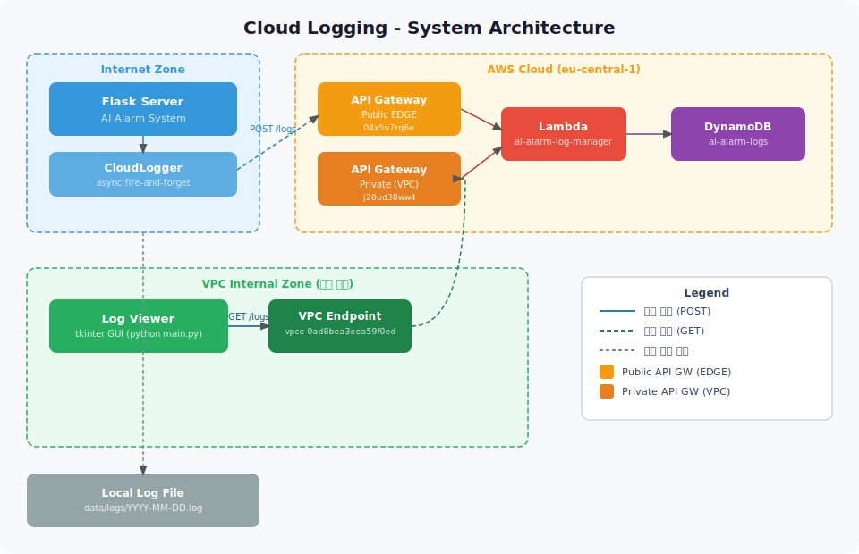
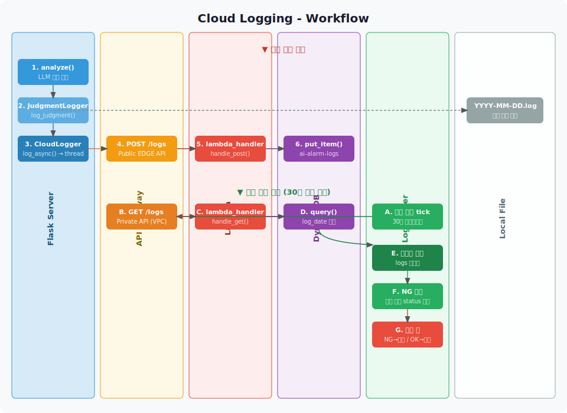

# Cloud Logging Architecture

서버에서 판정 결과를 AWS에 저장하고, Log Viewer로 조회하는 구조입니다.

## 다이어그램

### System Architecture


### Workflow


---

## 폴더 구조

```
cloud_logging/
├── lambda/
│   └── log_manager/
│       └── lambda_function.py   # AWS Lambda - POST/GET /logs
└── log_viewer/
    ├── __init__.py
    ├── api_client.py            # LogApiClient - API Gateway 조회
    ├── gui.py                   # CloudLogViewerGUI - tkinter UI
    └── main.py                  # 진입점
```

---

## 아키텍처 개요

```
Flask Server (인터넷 환경)
    │
    ├── local : JudgmentLogger → data/logs/YYYY-MM-DD.log
    └── cloud : CloudLogger (async) → Public API GW → Lambda → DynamoDB

Log Viewer (현장 장비, VPC 내부)
    └── Private API GW (VPC Endpoint) → Lambda → DynamoDB
```

---

## AWS 리소스

| 리소스 | 이름 | ID | 비고 |
|--------|------|----|------|
| API Gateway (Public) | ai-alarm-log-api | 04x5u7rq6e | EDGE, 서버용 |
| API Gateway (Private) | ai-alarm-log-api-private | j28ud38ww4 | VPC Internal, Log Viewer용 |
| Lambda | ai-alarm-log-manager | - | Python 3.12 |
| DynamoDB | ai-alarm-logs | - | PAY_PER_REQUEST |
| IAM Role | ai-alarm-log-lambda-role | - | BasicExecution + DynamoDB |
| VPC Endpoint | - | vpce-0ad8bea3eea59f0ed | execute-api 타입 |

---

## API Endpoint

| 환경 | URL |
|------|-----|
| 서버 (인터넷) | `https://04x5u7rq6e.execute-api.eu-central-1.amazonaws.com/prod/logs` |
| Log Viewer (dev/prod 공통) | `https://j28ud38ww4-vpce-0ad8bea3eea59f0ed.execute-api.eu-central-1.amazonaws.com/prod/logs` |

---

## API 명세

### POST /logs — 로그 저장

| 필드 | 타입 | 필수 | 설명 |
|------|------|------|------|
| request_id | String | ✅ | 요청 고유 ID |
| timestamp | String | ✅ | ISO 8601 (예: 2026-03-31T12:00:00) |
| status | String | ✅ | OK / NG / UNKNOWN |
| reason | String | | 판정 이유 |
| image_name | String | | 이미지 파일명 |
| processing_time_ms | Number | | 처리 시간 (ms) |
| equipment_data | Object | | 장비별 분석 데이터 (JSON 문자열로 저장) |

**Response**
```json
{ "message": "Log saved", "request_id": "...", "log_date": "2026-03-31" }
```

### GET /logs — 로그 조회

| 파라미터 | 필수 | 설명 |
|----------|------|------|
| date | | YYYY-MM-DD (기본값: 오늘) |
| request_id | | 특정 요청 조회 |
| limit | | 최대 건수 (기본값: 100) |

---

## DynamoDB 스키마

| 키 | 타입 | 설명 |
|----|------|------|
| log_date | String (PK) | YYYY-MM-DD |
| request_id | String (SK) | 요청 고유 ID |
| timestamp | String | ISO 8601 |
| status | String | OK / NG / UNKNOWN |
| reason | String | 판정 이유 |
| image_name | String | 이미지 파일명 |
| processing_time_ms | Number | 처리 시간 (ms) |
| equipment_data | String | 장비별 분석 데이터 (JSON 문자열) |

> `equipment_data`는 DynamoDB에 JSON 문자열로 저장, GET 응답 시 dict로 파싱하여 반환

---

## 서버 코드 구조

### CloudLogger (`server/services/cloud_logger.py`)
- `log_async(result)`: daemon 스레드로 비동기 업로드 (fire-and-forget)
- 업로드 실패 시 WARNING 로그만 기록, 서버 동작에 영향 없음

### 환경변수 (`server/.env`)
```
# 서버는 인터넷 환경이므로 항상 Public EDGE API 사용
LOG_API_URL=https://04x5u7rq6e.execute-api.eu-central-1.amazonaws.com/prod/logs
```

---

## Log Viewer

### 실행
```powershell
# cloud_logging/log_viewer 폴더 안에서
python main.py

# 프로젝트 루트에서
python -m cloud_logging.log_viewer.main
```

### dev / prod URL (`cloud_logging/log_viewer/api_client.py`)
```python
# Private API (VPC Endpoint DNS 방식) - dev/prod 공통
DEFAULT_API_URL = "https://j28ud38ww4-vpce-0ad8bea3eea59f0ed.execute-api.eu-central-1.amazonaws.com/prod/logs"
```

### 주요 기능
- 날짜별 / 최근 N일 로그 조회
- 자동 갱신 (기본 30초, 조절 가능)
- NG 발생 시 알림 창 자동 표시 (노란 배경, 빨간 텍스트)
  - 알림 창 위치: 좌/우/상/하 선택 가능
  - 알림 창 크기: 화면 비율로 조절 가능 (기본 0.25)
  - 모두 OK 시 알림 창 자동 닫힘
- 컬럼 클릭으로 정렬
- 키워드 필터

---

## Lambda 배포

```powershell
# 1. zip 생성
Compress-Archive -Path cloud_logging/lambda/log_manager/lambda_function.py `
  -DestinationPath cloud_logging/lambda/log_manager/function.zip -Force

# 2. Lambda 업데이트
aws lambda update-function-code --region eu-central-1 `
  --function-name ai-alarm-log-manager `
  --zip-file fileb://cloud_logging/lambda/log_manager/function.zip

# 3. API Gateway 재배포 (통합 설정 변경 시에만 필요)
aws apigateway create-deployment --rest-api-id 04x5u7rq6e --region eu-central-1 --stage-name prod
aws apigateway create-deployment --rest-api-id j28ud38ww4 --region eu-central-1 --stage-name prod
```

---

## Web Dashboard (Amplify)

React + Vite + TailwindCSS 기반의 웹 대시보드입니다.

- URL: https://main.d7rexzac4m6pv.amplifyapp.com
- App ID: `d7rexzac4m6pv`
- Region: `eu-central-1`
- Branch: `main`

### 폴더 구조

```
cloud_logging/web/
├── src/
│   ├── pages/
│   │   ├── Dashboard.tsx    # 대시보드 메인
│   │   └── LogViewer.tsx    # 로그 조회
│   ├── components/
│   │   ├── EquipmentDetail.tsx
│   │   └── Shared.tsx
│   ├── App.tsx
│   └── main.tsx
├── index.html
├── vite.config.ts
└── package.json
```

### Web Dashboard 배포 방법 (AWS CLI - Manual Zip Deploy)

Git 연동 없이 빌드 결과물을 직접 Amplify에 업로드하는 방식입니다.

```powershell
# 1. 빌드
npm run build --prefix cloud_logging/web

# 2. zip 패키징 (슬래시 경로 필수 - Python 사용)
python -c "
import zipfile, os
dist = 'cloud_logging/web/dist'
with zipfile.ZipFile('deploy.zip', 'w', zipfile.ZIP_DEFLATED) as zf:
    for root, dirs, files in os.walk(dist):
        for file in files:
            abs_path = os.path.join(root, file)
            rel_path = os.path.relpath(abs_path, dist).replace(os.sep, '/')
            zf.write(abs_path, rel_path)
"

# 3. 배포 job 생성 (업로드 URL 획득)
aws amplify create-deployment --region eu-central-1 --app-id d7rexzac4m6pv --branch-name main --output json
# → jobId, zipUploadUrl 확인

# 4. zip 업로드 (presigned URL 사용)
$url = "<zipUploadUrl>"
Invoke-RestMethod -Uri $url -Method Put -InFile "deploy.zip" -ContentType "application/zip"

# 5. 배포 시작
aws amplify start-deployment --region eu-central-1 --app-id d7rexzac4m6pv --branch-name main --job-id <jobId>

# 6. 배포 상태 확인
aws amplify get-job --region eu-central-1 --app-id d7rexzac4m6pv --branch-name main --job-id <jobId> --query "job.summary.status" --output text

# 7. 임시 파일 삭제
Remove-Item deploy.zip
```

> PowerShell의 `Compress-Archive`는 경로 구분자를 백슬래시(`\`)로 저장하여 Amplify가 `/assets/` 경로를 인식하지 못합니다. 반드시 Python으로 zip을 생성하세요.

### Amplify Rewrites and Redirects 설정

Amplify 콘솔 > Rewrites and redirects에 아래 규칙이 설정되어 있어야 합니다.

| Source | Target | Type |
|--------|--------|------|
| `/assets/<*>` | `/assets/<*>` | 200 (Rewrite) |
| `/<*>` | `/index.html` | 200 (Rewrite) |
